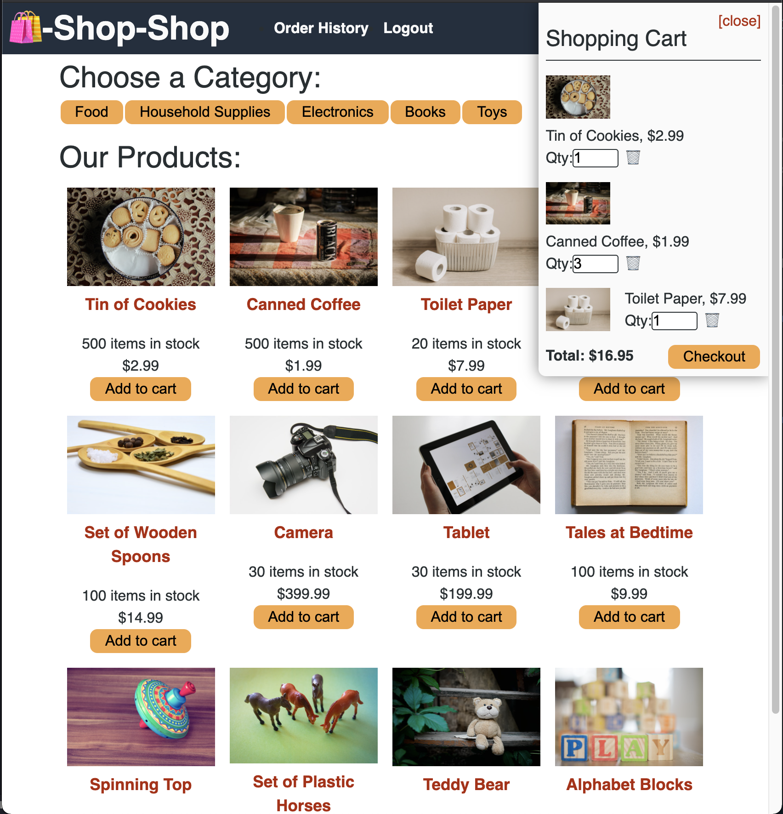

# shop-shop

    

## Description

Shop-Shop is an E-Commerce application where users can buy items from several categories of products. This is a MERN stack project which I refactored from using prop-drilling for state management to using React-Context-API for global state management. I also implemented an IndexedDB object store for offline use, implemented Stripe for payment management and deployed the application to Heroku. 

## Table of Contents:
* [Installation](#installation)
* [Usage](#usage)
* [Screenshot](#screenshot)
* [Credits](#credits)

## Installation 

This projects development environment uses concurrently to run both the server and client server at the same time from the root directory, if you find the start command does not work from root, try running both the client and server from separate command line tabs. 

## Usage 

## Screenshot

      

## Credits

UT Austin Coding Bootcamp

## License 

MIT
